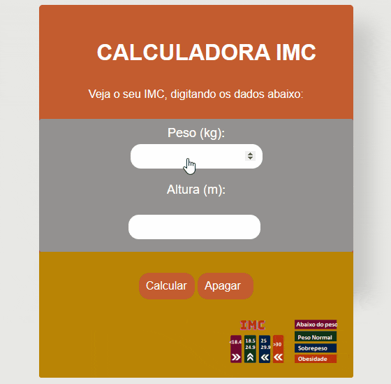

# Calculadora do IMC

## Objetivo

- Esse projeto tem como objetivo a criação de uma calculadora de IMC utilizando HTML 5, CSS 3 e Javascript.

- Foi desenvolvido para o aprendizado e aplicação na prática dos conceitos básicos dessas linguagens.

## Layout

Uma breve demonstração da calculadora está descrita logo abaixo, apresentando todas as suas funcionalidades:

## Definição

>O **índice de massa corporal (IMC)** é uma medida internacional usada para calcular se uma pessoa está no peso ideal, levando em conta o seu peso `(kg)` e sua altura `(m)`. Indicada para avaliar o estado nutricional em adultos, tendo como os níveis recomendados de `18,5-24,9` como um IMC normal [OMS](https://www.who.int/europe/news-room/fact-sheets/item/a-healthy-lifestyle---who-recommendations).

## Cálculo

O IMC é determinado é dividindo-se o `peso (em kg)` pelo quadrado da `altura (em metros)`. O resultado revela se o peso está dentro da faixa ideal, abaixo ou acima do desejado.

## Tabela de IMC

Para adultos com mais de 20 anos de idade, o IMC se enquadra em uma das seguintes categorias:

`Classificação do IMC em adultos segundo a OMS (Organização Mundial da Saúde)`
| IMC |    Estado nutricional
| ----------------------| -----------------------------------|
| < 18,5               | Abaixo do peso          |
| 18.5–24.9        | Peso normal                |
| 25.0–29.9        | Sobrepeso                        |
| 30.0–34.9| Obesidade classe             I
| 30.0–34.9| Obesidade classe II         |
| >40| Obesidade classe III                  |

## Limitações do IMC

Segundo [SANTOS](https://brasilescola.uol.com.br/saude-na-escola/limitacoes-imc.htm>), o IMC apresenta suas limitações e nunca deve ser usado como único modo de avaliar se uma pessoa está ou não acima do peso. Como por exemplo Idosos, Mulheres e Gestantes:

- Idosos apresentam uma mudança na proporção entre a gordura corporal e a massa magra.

- Mulheres e homens possuem padrões de gordura corporal diferentes. A mulher geralmente apresenta uma maior porcentagem de gordura.

- A gravidez gera resultados errados, pois o peso proveniente da gestação pode ser confundido com obesidade.

## Referências

1.[Wikipedia]( https://pt.wikipedia.org/wiki/%C3%8Dndice_de_massa_corporal)

2.[BVS]( https://bvsms.saude.gov.br/bvs/dicas/215_obesidade.html)

3.[OMS]( https://www.who.int/europe/news-room/fact-sheets/item/a-healthy-lifestyle---who-recommendations)

4.[Ebook]( https://pt.scribd.com/document/521850175/Ebook-7-Exercicios-Resolvidos-de-Logica-de-Programacao-com-JavaScript)

5.[Mini projetos JS-IMC](https://youtu.be/RacwEvoTz_Y)

6.[Badge]( https://shields.io)

7.[Santos](<https://brasilescola.uol.com.br/saude-na-escola/limitacoes-imc.htm>)
